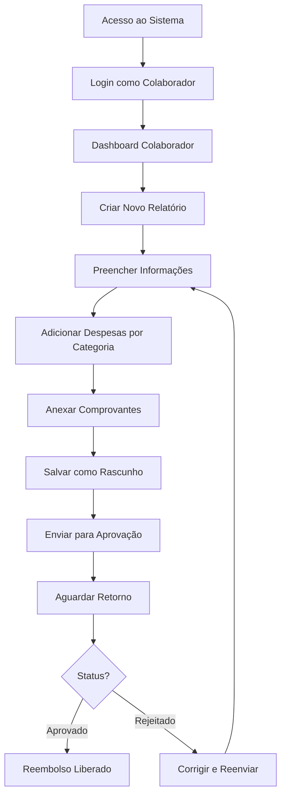
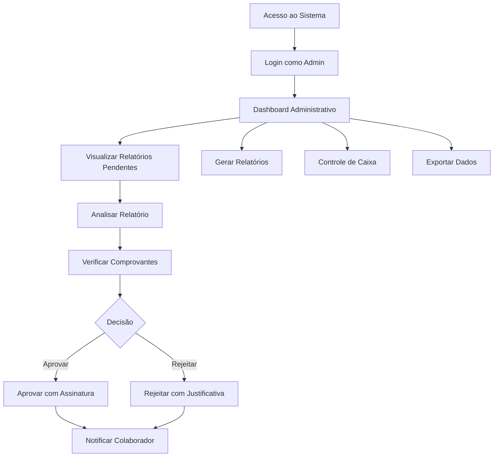

# PRD - Sistema de Relatório de Despesas Corporativas CLIGED

## 1. **Visão Geral do Produto**

### 1.1 **Resumo Executivo**
O Sistema de Relatório de Despesas Corporativas CLIGED é uma aplicação web desenvolvida em React que permite o gerenciamento eficiente de despesas corporativas. O sistema oferece funcionalidades distintas para colaboradores e administradores, facilitando o processo de criação, aprovação e controle de relatórios de despesas.

### 1.2 **Objetivos do Produto**
- **Automatizar** o processo de criação e aprovação de relatórios de despesas
- **Centralizar** o controle financeiro das despesas corporativas
- **Facilitar** a comunicação entre colaboradores e área financeira
- **Aumentar** a transparência e auditabilidade dos gastos empresariais
- **Reduzir** o tempo de processamento de reembolsos

## 2. **Stakeholders e Personas**

### 2.1 **Colaboradores** 
- Profissionais que precisam registrar despesas de trabalho
- Necessitam de processo simples para anexar comprovantes
- Precisam acompanhar status de aprovação dos relatórios

### 2.2 **Administradores/Financeiro**
- Gestores financeiros responsáveis pela aprovação
- Precisam de visão consolidada das despesas
- Necessitam de relatórios e controles para auditoria

## 3. **Tecnologias Utilizadas**

### 3.1 **Frontend**
- **React 18.2.0** - Framework principal
- **Vite 4.4.5** - Bundler e servidor de desenvolvimento
- **TailwindCSS 3.3.3** - Framework CSS para estilização
- **Framer Motion 10.16.4** - Animações e transições

### 3.2 **Componentes UI**
- **Radix UI** - Componentes acessíveis (dialogs, dropdowns, etc.)
- **Lucide React** - Biblioteca de ícones
- **Recharts 2.9.0** - Componentes para gráficos e visualizações

### 3.3 **Funcionalidades Especiais**
- **React Helmet 6.1.0** - Gerenciamento de meta tags
- **JSZip 3.10.1** - Compressão de arquivos para download
- **Camera Capture** - Captura de fotos via câmera do dispositivo

## 4. **Funcionalidades Principais**

### 4.1 **Sistema de Autenticação**
- **Login diferenciado** por tipo de usuário (Colaborador/Administrador)
- **Persistência** de sessão via localStorage
- **Logout** seguro com limpeza de dados

### 4.2 **Gestão de Despesas (Colaborador)**

#### 4.2.1 **Criação de Relatórios**
- **Formulário estruturado** com informações obrigatórias:
  - Nome completo do colaborador
  - CPF (formatação automática)
  - Unidade de trabalho (Macaé, Barra da Tijuca, Cabo Frio, etc.)
  - Setor (Terapia Assistida, Endoscopia, IPEC, etc.)

#### 4.2.2 **Categorização de Despesas**
- **Transporte** - Despesas com locomoção
- **Alimentação** - Gastos com refeições
- **Despesas com Viagem** - Custos de viagens de trabalho  
- **Despesas com Treinamento** - Investimentos em capacitação

#### 4.2.3 **Anexação de Comprovantes**
- **Upload de arquivos** (JPG, PNG, PDF até 5MB)
- **Captura via câmera** do dispositivo
- **Visualização** de comprovantes anexados
- **Armazenamento local** seguro (localStorage)

#### 4.2.4 **Estados do Relatório**
- **Rascunho** - Salvo localmente, permite edição
- **Pendente** - Enviado para aprovação
- **Aprovado** - Liberado para reembolso
- **Rejeitado** - Devolvido com justificativa

### 4.3 **Painel Administrativo**

#### 4.3.1 **Dashboard Executivo**
- **Estatísticas em tempo real**:
  - Número de relatórios pendentes
  - Total aprovado por mês
  - Gráficos de despesas por categoria
- **Filtros avançados** por status, colaborador e período

#### 4.3.2 **Processo de Aprovação**
- **Visualização detalhada** de cada relatório
- **Sistema de aprovação/rejeição** com justificativa
- **Assinatura digital** com timestamp do aprovador
- **Histórico completo** de ações realizadas

#### 4.3.3 **Controle Financeiro**
- **Cálculos automáticos**:
  - Total de gastos
  - Valores a receber
  - Valores a devolver
  - Saldo de adiantamentos
- **Situação do caixa** por período
- **Controle mensal** consolidado

#### 4.3.4 **Exportação e Relatórios**
- **Export em CSV** para análise externa
- **Export formato TASY** (sistema integrado)
- **Relatório PDF consolidado**
- **Download em ZIP** de todos os comprovantes

## 5. **Interface e Experiência do Usuário**

### 5.1 **Design System**
- **Interface responsiva** com TailwindCSS
- **Tema corporativo** com cores da CLIGED
- **Componentes acessíveis** baseados em Radix UI
- **Animações suaves** com Framer Motion

### 5.2 **Navegação**
- **SPA (Single Page Application)** com roteamento interno
- **Breadcrumbs** e navegação intuitiva
- **Estados de loading** e feedback visual
- **Toasts** para notificações de ações

### 5.3 **Responsividade**
- **Design mobile-first**
- **Adaptação automática** para tablets e desktops
- **Otimização** para uso em campo via dispositivos móveis

## 6. **Armazenamento e Persistência**

### 6.1 **LocalStorage**
- **Relatórios de despesas** - Armazenamento principal dos dados
- **Comprovantes** - Imagens em base64
- **Sessão do usuário** - Dados de autenticação
- **Configurações** - Preferências do usuário

### 6.2 **Estrutura de Dados**
```javascript
// Exemplo de estrutura de relatório
{
  id: "timestamp",
  userId: "user_id", 
  userName: "Nome Completo",
  cpf: "000.000.000-00",
  unit: "macae",
  sector: "terapia_assistida",
  date: "2025-10-23",
  status: "pending|approved|rejected",
  transport: [...],
  food: [...], 
  miscellaneous: [...],
  advances: [...],
  signatures: [...],
  totalAmount: 1500.00,
  createdAt: "2025-10-23T23:59:18Z"
}
```

## 7. **Segurança e Compliance**

### 7.1 **Proteção de Dados**
- **Validação de CPF** com formatação automática
- **Controle de tamanho** de arquivos anexados
- **Sanitização** de inputs do usuário

### 7.2 **Auditoria**
- **Log completo** de todas as ações realizadas
- **Assinaturas digitais** com timestamp
- **Rastreabilidade** de alterações nos relatórios

## 8. **Performance e Otimização**

### 8.1 **Build e Deploy**
- **Vite** para bundling otimizado
- **Code splitting** automático
- **Compressão** de assets estáticos
- **Tree shaking** para redução do bundle

### 8.2 **Otimizações**
- **Lazy loading** de componentes pesados
- **Memoização** de cálculos complexos
- **Debounce** em campos de busca
- **Compressão de imagens** para comprovantes

## 9. **Requisitos Técnicos**

### 9.1 **Compatibilidade**
- **Navegadores modernos** (Chrome 90+, Firefox 88+, Safari 14+)
- **Node.js 20+** para desenvolvimento
- **Dispositivos móveis** com câmera

### 9.2 **Dependências Principais**
- React ecosystem completo
- UI components (Radix UI)
- Utilitários (date-fns, file handling)
- Build tools (Vite, PostCSS, Terser)

## 10. **Fluxo de Trabalho**

### 10.1 **Fluxo do Colaborador**


### 10.2 **Fluxo do Administrador**


## 11. **Métricas e KPIs**

### 11.1 **Métricas de Performance**
- **Tempo médio de aprovação** de relatórios
- **Taxa de rejeição** de relatórios
- **Volume de despesas** por categoria/período
- **Tempo de processamento** de reembolsos

### 11.2 **Métricas de Usabilidade**
- **Taxa de conclusão** de relatórios iniciados
- **Frequência de uso** por colaborador
- **Erros de preenchimento** mais comuns
- **Satisfação do usuário** (NPS)

## 12. **Roadmap e Evoluções Futuras**

### 12.1 **Fase 1 - Melhorias Imediatas (Q1 2025)**
- **Integração com backend** para persistência em servidor
- **Sistema de notificações** por email
- **Backup automatizado** de dados

### 12.2 **Fase 2 - Expansão (Q2-Q3 2025)**
- **API REST** para integração com sistemas de RH
- **Aplicativo mobile** nativo (React Native)
- **Relatórios avançados** com Business Intelligence

### 12.3 **Fase 3 - Escalabilidade (Q4 2025)**
- **Multi-tenancy** para diferentes empresas
- **Controle de versões** de relatórios
- **Integrações bancárias** para conciliação automática

## 13. **Considerações de Implementação**

### 13.1 **Arquitetura Atual**
- **Frontend-only** com persistência local
- **Componentização** modular e reutilizável
- **Estado global** gerenciado via React hooks
- **Responsividade** nativa com TailwindCSS

### 13.2 **Limitações Conhecidas**
- **Armazenamento limitado** do localStorage
- **Falta de sincronização** entre dispositivos
- **Ausência de backup** automático
- **Dependência** de JavaScript habilitado

### 13.3 **Recomendações Técnicas**
- **Migração gradual** para arquitetura cliente-servidor
- **Implementação de PWA** para melhor experiência mobile
- **Otimização de imagens** com compressão inteligente
- **Testes automatizados** para garantir qualidade

---

**Versão:** 1.0  
**Data:** Outubro 2025  
**Responsável:** Sistema de Desenvolvimento CLIGED  
**Status:** Documentação Técnica Completa

Este documento serve como referência completa para o desenvolvimento, manutenção e evolução do Sistema de Relatório de Despesas Corporativas CLIGED.